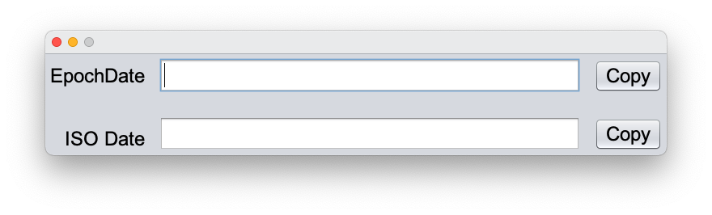
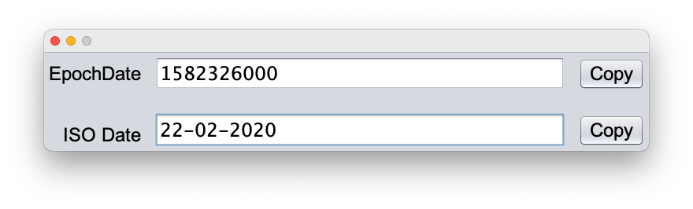
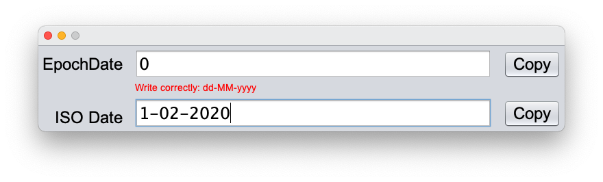

# ToEpochDate
----------------

Simple program to convert dates from the usual spanish format (dd-MM-yyyy) to POSIX time. 
It translates to epoch seconds. It does not take in consideration the exactly time just the date.

## Screenshots

